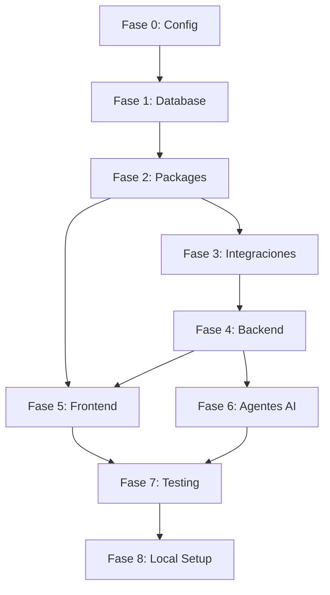

# 📋 TODO LIST MAESTRO — Tradingbot Implementation

**Versión:** 1.0
**Fecha:** 2026-01-31
**Coordinador:** `/coordinator` Agent
**Estado:** EN PLANIFICACIÓN

---

## 🎯 OBJETIVO

Implementar el 100% del proyecto Tradingbot con:
- ✅ Aplicación funcionando localmente
- ✅ Base de datos Supabase completa con RLS
- ✅ Backend microservicios operativos
- ✅ Frontend Trading Workbench funcional
- ✅ Integraciones (Hyperliquid, Alpaca, OpenAI)

---

## 📊 RESUMEN DE PROGRESO

```
FASE 0: Configuración Inicial     [░░░░░░░░░░] 0%
FASE 1: Supabase & Database       [░░░░░░░░░░] 0%
FASE 2: Packages Compartidos      [░░░░░░░░░░] 0%
FASE 3: Integraciones Externas    [░░░░░░░░░░] 0%
FASE 4: Backend Microservicios    [░░░░░░░░░░] 0%
FASE 5: Frontend Workbench        [░░░░░░░░░░] 0%
FASE 6: Agentes OpenAI            [░░░░░░░░░░] 0%
FASE 7: Testing & Validación      [░░░░░░░░░░] 0%
FASE 8: Local Development Setup   [░░░░░░░░░░] 0%
─────────────────────────────────────────────────
TOTAL:                            [░░░░░░░░░░] 0%
```

---

## 🎭 ASIGNACIÓN DE AGENTES

| Agente | Responsabilidad | Fases |
|--------|-----------------|-------|
| `/arquitecto` | Validar arquitectura, aprobar cambios | Todas |
| `/db-integration` | Supabase, migraciones, RLS | 1 |
| `/fullstack-dev` | Frontend, Server Actions, UI | 2, 5 |
| `/security-qa` | Seguridad, validaciones, permisos | 1, 7 |
| `/testing-expert` | Tests E2E, unitarios | 7 |
| `/coordinator` | Orquestar agentes, tracking | Todas |

---

# FASE 0: CONFIGURACIÓN INICIAL

**Agente Principal:** `/arquitecto`
**Dependencias:** Ninguna

## 0.1 Verificación del Entorno

- [ ] **0.1.1** Verificar Node.js >= 20.x instalado
  ```bash
  node --version  # debe ser >= 20.0.0
  ```

- [ ] **0.1.2** Verificar pnpm instalado
  ```bash
  pnpm --version  # debe ser >= 10.x
  ```

- [ ] **0.1.3** Verificar Docker instalado (para Supabase local)
  ```bash
  docker --version
  docker compose --version
  ```

- [ ] **0.1.4** Verificar Supabase CLI instalado
  ```bash
  npx supabase --version
  ```

## 0.2 Instalación de Dependencias Base

- [ ] **0.2.1** Instalar dependencias del monorepo
  ```bash
  pnpm install
  ```

- [ ] **0.2.2** Verificar que el proyecto compila
  ```bash
  pnpm run typecheck
  ```

- [ ] **0.2.3** Verificar que lint pasa
  ```bash
  pnpm run lint
  ```

## 0.3 Configuración de Variables de Entorno

- [ ] **0.3.1** Crear archivo `.env.local` en `apps/web/`
  ```env
  # Supabase
  NEXT_PUBLIC_SUPABASE_URL=http://localhost:54321
  NEXT_PUBLIC_SUPABASE_ANON_KEY=[se genera al iniciar supabase]
  SUPABASE_SERVICE_ROLE_KEY=[se genera al iniciar supabase]

  # Alpaca (Paper)
  ALPACA_PAPER_KEY=
  ALPACA_PAPER_SECRET=

  # OpenAI
  OPENAI_API_KEY=

  # Feature Flags
  NEXT_PUBLIC_ENABLE_LIVE_TRADING=false
  ```

- [ ] **0.3.2** Crear archivo `.env` para servicios backend
  ```env
  # En services/.env
  SUPABASE_URL=http://localhost:54321
  SUPABASE_SERVICE_KEY=[service role key]
  HL_WS_URL=wss://api.hyperliquid.xyz/ws
  ALPACA_PAPER_KEY=
  ALPACA_PAPER_SECRET=
  OPENAI_API_KEY=
  ```

## 0.4 Inicialización de Supabase Local

- [ ] **0.4.1** Iniciar Supabase local
  ```bash
  cd apps/web
  npx supabase start
  ```

- [ ] **0.4.2** Guardar credenciales generadas
  ```
  API URL: http://localhost:54321
  anon key: eyJh...
  service_role key: eyJh...
  ```

- [ ] **0.4.3** Verificar acceso a Supabase Studio
  ```
  http://localhost:54323
  ```

---

# FASE 1: SUPABASE & DATABASE

**Agente Principal:** `/db-integration`
**Validación:** `/security-qa`
**Dependencias:** Fase 0 completada

## 1.1 Migración Principal — Crear Tipos ENUM

**Archivo:** `apps/web/supabase/migrations/20260131000001_enums.sql`

- [ ] **1.1.1** Crear enum `strategy_mode`
- [ ] **1.1.2** Crear enum `setup_type`
- [ ] **1.1.3** Crear enum `intent_status`
- [ ] **1.1.4** Crear enum `order_status`
- [ ] **1.1.5** Crear enum `order_type`
- [ ] **1.1.6** Crear enum `order_side`
- [ ] **1.1.7** Crear enum `time_in_force`
- [ ] **1.1.8** Crear enum `risk_severity`
- [ ] **1.1.9** Crear enum `whale_status`
- [ ] **1.1.10** Crear enum `strategy_state`

## 1.2 Migración — Tablas Core de Trading

**Archivo:** `apps/web/supabase/migrations/20260131000002_trading_tables.sql`

- [ ] **1.2.1** Crear tabla `strategies`
  - Campos: id, user_id, name, description, enabled, mode, symbol, current_state, timestamps
  - Constraint: UNIQUE(user_id, name)

- [ ] **1.2.2** Crear tabla `strategy_versions`
  - Campos: id, strategy_id, version, config_json, is_active, notes, timestamps
  - Constraint: UNIQUE(strategy_id, version)

- [ ] **1.2.3** Crear tabla `signals`
  - Campos: id, strategy_id, ts, setup, scores_json, confirmations_json, levels_json, raw_data_ref
  - Índice: idx_signals_strategy_ts

- [ ] **1.2.4** Crear tabla `trade_intents`
  - Campos: id, strategy_id, signal_id, side, qty_usd, intended_price, status, risk_decision, timestamps
  - Índices: idx_intents_strategy, idx_intents_status

- [ ] **1.2.5** Crear tabla `orders`
  - Campos: id, intent_id, strategy_id, alpaca_order_id, client_order_id, symbol, side, order_type, qty, limit_price, stop_price, time_in_force, status, filled_qty, filled_avg_price, is_paper, raw_request, raw_response, timestamps
  - Índices: idx_orders_strategy, idx_orders_status

- [ ] **1.2.6** Crear tabla `fills`
  - Campos: id, order_id, alpaca_fill_id, price, qty, notional, fee, filled_at, raw_data
  - Índice: idx_fills_order

- [ ] **1.2.7** Crear tabla `positions`
  - Campos: id, strategy_id, user_id, symbol, side, qty, avg_entry_price, current_price, unrealized_pnl, realized_pnl, entry_intent_id, entry_order_id, entry_at, stop_loss_price, take_profit_price, is_open, closed_at, close_reason, timestamps
  - Constraint: UNIQUE(strategy_id, symbol)
  - Índice: idx_positions_open

## 1.3 Migración — Tablas de Riesgo

**Archivo:** `apps/web/supabase/migrations/20260131000003_risk_tables.sql`

- [ ] **1.3.1** Crear tabla `risk_events`
  - Campos: id, strategy_id, user_id, ts, severity, code, message, details_json, action_taken, acknowledged, acknowledged_at, acknowledged_by
  - Índices: idx_risk_events_strategy, idx_risk_events_severity

- [ ] **1.3.2** Crear tabla `risk_bumpers_state`
  - Campos: id, user_id, strategy_id, trading_day, daily_loss_usd, daily_trades_count, cooldown_until, cooldown_reason, kill_switch_active, kill_switch_reason, kill_switch_at, updated_at
  - Constraint: UNIQUE(user_id, strategy_id, trading_day)

## 1.4 Migración — Tablas de Whales

**Archivo:** `apps/web/supabase/migrations/20260131000004_whale_tables.sql`

- [ ] **1.4.1** Crear tabla `whale_watchlist`
  - Campos: id, user_id, address, label, source, score, rank, status, notes, tags, timestamps, last_activity_at
  - Constraint: UNIQUE(user_id, address)
  - Índice: idx_whale_watchlist_user

- [ ] **1.4.2** Crear tabla `whale_snapshots`
  - Campos: id, whale_id, ts, state_json, delta_json, is_significant, significance_reason
  - Índices: idx_whale_snapshots_whale, idx_whale_snapshots_significant

- [ ] **1.4.3** Crear tabla `whale_events`
  - Campos: id, whale_id, snapshot_id, ts, event_type, symbol, direction, details_json, used_as_confirmation, used_in_signal_id
  - Índice: idx_whale_events_ts

## 1.5 Migración — Tablas de Agentes AI

**Archivo:** `apps/web/supabase/migrations/20260131000005_agent_tables.sql`

- [ ] **1.5.1** Crear tabla `agent_traces`
  - Campos: id, user_id, strategy_id, ts, agent_name, intent_id, signal_id, input_summary, input_ref, output_json, eval_score, eval_feedback, tokens_input, tokens_output, cost_usd, latency_ms, model_used
  - Índices: idx_agent_traces_user, idx_agent_traces_agent

- [ ] **1.5.2** Crear tabla `agent_proposals`
  - Campos: id, user_id, strategy_id, agent_trace_id, ts, proposal_type, title, description, current_config, proposed_config, diff_summary, rationale, expected_impact, status, reviewed_at, reviewed_by, review_notes, applied_at, applied_version_id, expires_at
  - Índice: idx_proposals_pending

## 1.6 Migración — Tablas de Sistema

**Archivo:** `apps/web/supabase/migrations/20260131000006_system_tables.sql`

- [ ] **1.6.1** Crear tabla `market_data_cache`
  - Campos: id, symbol, data_type, ts, data_json, source, created_at, expires_at
  - Índice: idx_market_data_symbol_ts

- [ ] **1.6.2** Crear tabla `daily_metrics`
  - Campos: id, user_id, strategy_id, trading_day, total_trades, winning_trades, losing_trades, gross_pnl, fees_paid, net_pnl, max_drawdown, max_position_size, signals_generated, signals_executed, signals_rejected, win_rate, avg_win, avg_loss, profit_factor, sharpe_ratio, timestamps
  - Constraint: UNIQUE(user_id, strategy_id, trading_day)
  - Índice: idx_daily_metrics_user

- [ ] **1.6.3** Crear tabla `system_config`
  - Campos: id, user_id, alpaca_paper_enabled, alpaca_live_enabled, enable_whale_tracking, enable_agent_explanations, enable_agent_proposals, notify_on_trade, notify_on_risk_event, notify_on_proposal, notification_channels, alpaca_key_ref, openai_key_ref, timestamps
  - Constraint: UNIQUE(user_id)

- [ ] **1.6.4** Crear tabla `api_keys`
  - Campos: id, user_id, provider, key_name, api_key_encrypted, api_secret_encrypted, is_active, is_valid, last_validated_at, validation_error, last_used_at, timestamps
  - Constraint: UNIQUE(user_id, provider)

- [ ] **1.6.5** Crear tabla `audit_log`
  - Campos: id, user_id, ts, action, entity_type, entity_id, old_value, new_value, ip_address, user_agent, source
  - Índices: idx_audit_log_user, idx_audit_log_entity

## 1.7 Migración — Row Level Security (RLS)

**Archivo:** `apps/web/supabase/migrations/20260131000007_rls_policies.sql`

- [ ] **1.7.1** Habilitar RLS en todas las tablas (20 tablas)
- [ ] **1.7.2** Crear policies para `strategies` (SELECT, INSERT, UPDATE, DELETE)
- [ ] **1.7.3** Crear policies para `strategy_versions` (SELECT, INSERT)
- [ ] **1.7.4** Crear policies para `signals` (SELECT)
- [ ] **1.7.5** Crear policies para `trade_intents` (SELECT)
- [ ] **1.7.6** Crear policies para `orders` (SELECT)
- [ ] **1.7.7** Crear policies para `fills` (SELECT)
- [ ] **1.7.8** Crear policies para `positions` (SELECT)
- [ ] **1.7.9** Crear policies para `risk_events` (SELECT)
- [ ] **1.7.10** Crear policies para `risk_bumpers_state` (SELECT, UPDATE)
- [ ] **1.7.11** Crear policies para `whale_watchlist` (ALL)
- [ ] **1.7.12** Crear policies para `whale_snapshots` (SELECT)
- [ ] **1.7.13** Crear policies para `whale_events` (SELECT)
- [ ] **1.7.14** Crear policies para `agent_traces` (SELECT)
- [ ] **1.7.15** Crear policies para `agent_proposals` (SELECT, UPDATE)
- [ ] **1.7.16** Crear policies para `daily_metrics` (SELECT)
- [ ] **1.7.17** Crear policies para `system_config` (ALL)
- [ ] **1.7.18** Crear policies para `api_keys` (ALL)
- [ ] **1.7.19** Crear policies para `audit_log` (SELECT)
- [ ] **1.7.20** Crear policies para service_role (full access)

## 1.8 Migración — Triggers y Funciones

**Archivo:** `apps/web/supabase/migrations/20260131000008_triggers.sql`

- [ ] **1.8.1** Crear función `update_updated_at_column()`
- [ ] **1.8.2** Crear trigger `update_strategies_updated_at`
- [ ] **1.8.3** Crear trigger `update_positions_updated_at`
- [ ] **1.8.4** Crear trigger `update_orders_updated_at`
- [ ] **1.8.5** Crear función `handle_new_user_tradingbot()`
- [ ] **1.8.6** Crear trigger `on_auth_user_created_tradingbot`
- [ ] **1.8.7** Crear función `cleanup_old_market_data()`

## 1.9 Migración — Realtime

**Archivo:** `apps/web/supabase/migrations/20260131000009_realtime.sql`

- [ ] **1.9.1** Agregar `signals` a supabase_realtime
- [ ] **1.9.2** Agregar `orders` a supabase_realtime
- [ ] **1.9.3** Agregar `fills` a supabase_realtime
- [ ] **1.9.4** Agregar `positions` a supabase_realtime
- [ ] **1.9.5** Agregar `risk_events` a supabase_realtime
- [ ] **1.9.6** Agregar `agent_traces` a supabase_realtime
- [ ] **1.9.7** Agregar `agent_proposals` a supabase_realtime

## 1.10 Aplicar Migraciones

- [ ] **1.10.1** Ejecutar todas las migraciones
  ```bash
  cd apps/web
  npx supabase db push
  ```

- [ ] **1.10.2** Verificar tablas creadas en Supabase Studio
- [ ] **1.10.3** Verificar RLS habilitado en todas las tablas
- [ ] **1.10.4** Generar tipos TypeScript
  ```bash
  npx supabase gen types typescript --local > ../packages/supabase/src/database.types.ts
  ```

---

# FASE 2: PACKAGES COMPARTIDOS

**Agente Principal:** `/fullstack-dev`
**Validación:** `/arquitecto`
**Dependencias:** Fase 1 completada

## 2.1 Package: @kit/trading-core

**Ubicación:** `packages/trading-core/`

- [ ] **2.1.1** Crear estructura del package
  ```
  packages/trading-core/
  ├── src/
  │   ├── types/
  │   ├── schemas/
  │   ├── constants/
  │   └── utils/
  ├── package.json
  └── tsconfig.json
  ```

- [ ] **2.1.2** Crear `package.json`
  ```json
  {
    "name": "@kit/trading-core",
    "version": "0.1.0",
    "main": "./src/index.ts",
    "types": "./src/index.ts",
    "exports": {
      "./types": "./src/types/index.ts",
      "./schemas": "./src/schemas/index.ts",
      "./constants": "./src/constants/index.ts",
      "./utils": "./src/utils/index.ts"
    }
  }
  ```

### 2.1.3 Types

- [ ] **2.1.3.1** Crear `types/strategy.ts`
  ```typescript
  export interface Strategy {
    id: string;
    user_id: string;
    name: string;
    description?: string;
    enabled: boolean;
    mode: 'paper' | 'live' | 'disabled';
    symbol: string;
    current_state: StrategyState;
    state_updated_at?: string;
    created_at: string;
    updated_at: string;
  }

  export type StrategyState =
    | 'IDLE'
    | 'SETUP'
    | 'TRIGGERED'
    | 'ORDERING'
    | 'IN_POSITION'
    | 'EXITING'
    | 'COOLDOWN';
  ```

- [ ] **2.1.3.2** Crear `types/signal.ts`
- [ ] **2.1.3.3** Crear `types/order.ts`
- [ ] **2.1.3.4** Crear `types/position.ts`
- [ ] **2.1.3.5** Crear `types/risk.ts`
- [ ] **2.1.3.6** Crear `types/whale.ts`
- [ ] **2.1.3.7** Crear `types/agent.ts`
- [ ] **2.1.3.8** Crear `types/index.ts` (exports)

### 2.1.4 Schemas (Zod)

- [ ] **2.1.4.1** Crear `schemas/strategy.schema.ts`
  ```typescript
  import { z } from 'zod';

  export const CreateStrategySchema = z.object({
    name: z.string().min(1).max(100),
    description: z.string().optional(),
    symbol: z.string().default('BTC/USD'),
    mode: z.enum(['paper', 'live', 'disabled']).default('paper'),
  });

  export const StrategyConfigSchema = z.object({
    entry: z.object({
      flush_threshold: z.number().min(0).max(1),
      burst_threshold: z.number().min(0).max(1),
      absorption_threshold: z.number().min(0).max(1),
      require_reclaim: z.boolean(),
      require_whale_event: z.boolean(),
    }),
    exit: z.object({
      tp_percent: z.number().min(0).max(100),
      sl_percent: z.number().min(0).max(100),
      time_stop_minutes: z.number().min(1),
      trailing_stop_enabled: z.boolean(),
      trailing_stop_percent: z.number().min(0).max(100).optional(),
    }),
    execution: z.object({
      order_type: z.enum(['market', 'limit']),
      limit_slippage_percent: z.number().min(0).max(10).optional(),
      limit_timeout_seconds: z.number().min(1).max(300).optional(),
      retry_attempts: z.number().min(0).max(5),
    }),
    risk: z.object({
      max_position_usd: z.number().min(0),
      max_daily_loss_usd: z.number().min(0),
      max_trades_per_day: z.number().min(1).max(100),
      cooldown_after_loss_minutes: z.number().min(0),
    }),
  });
  ```

- [ ] **2.1.4.2** Crear `schemas/order.schema.ts`
- [ ] **2.1.4.3** Crear `schemas/whale.schema.ts`
- [ ] **2.1.4.4** Crear `schemas/risk.schema.ts`
- [ ] **2.1.4.5** Crear `schemas/api-key.schema.ts`
- [ ] **2.1.4.6** Crear `schemas/index.ts` (exports)

### 2.1.5 Constants

- [ ] **2.1.5.1** Crear `constants/states.ts`
- [ ] **2.1.5.2** Crear `constants/order-types.ts`
- [ ] **2.1.5.3** Crear `constants/risk-codes.ts`
- [ ] **2.1.5.4** Crear `constants/index.ts`

### 2.1.6 Utils

- [ ] **2.1.6.1** Crear `utils/pnl.ts`
  ```typescript
  export function calculatePnL(
    entryPrice: number,
    currentPrice: number,
    qty: number,
    side: 'buy' | 'sell'
  ): number {
    const diff = currentPrice - entryPrice;
    return side === 'buy' ? diff * qty : -diff * qty;
  }

  export function calculatePnLPercent(
    entryPrice: number,
    currentPrice: number,
    side: 'buy' | 'sell'
  ): number {
    const diff = currentPrice - entryPrice;
    const percent = (diff / entryPrice) * 100;
    return side === 'buy' ? percent : -percent;
  }
  ```

- [ ] **2.1.6.2** Crear `utils/formatting.ts`
- [ ] **2.1.6.3** Crear `utils/risk.ts`
- [ ] **2.1.6.4** Crear `utils/index.ts`

## 2.2 Package: @kit/integrations

**Ubicación:** `packages/integrations/`

- [ ] **2.2.1** Crear estructura del package
  ```
  packages/integrations/
  ├── src/
  │   ├── hyperliquid/
  │   ├── alpaca/
  │   └── openai/
  ├── package.json
  └── tsconfig.json
  ```

- [ ] **2.2.2** Crear `package.json` con dependencias
  ```json
  {
    "name": "@kit/integrations",
    "dependencies": {
      "ws": "^8.16.0",
      "@alpaca-hq/alpaca-ts": "^3.0.0",
      "openai": "^4.25.0"
    }
  }
  ```

### 2.2.3 Hyperliquid Client

- [ ] **2.2.3.1** Crear `hyperliquid/types.ts`
- [ ] **2.2.3.2** Crear `hyperliquid/websocket.ts`
  ```typescript
  import WebSocket from 'ws';

  export class HyperliquidWebSocket {
    private ws: WebSocket | null = null;
    private reconnectAttempts = 0;
    private maxReconnectAttempts = 10;
    private subscriptions: Map<string, Function> = new Map();

    constructor(private url: string = 'wss://api.hyperliquid.xyz/ws') {}

    async connect(): Promise<void> {
      return new Promise((resolve, reject) => {
        this.ws = new WebSocket(this.url);

        this.ws.on('open', () => {
          this.reconnectAttempts = 0;
          resolve();
        });

        this.ws.on('message', (data) => this.handleMessage(data));
        this.ws.on('close', () => this.handleDisconnect());
        this.ws.on('error', reject);
      });
    }

    subscribe(channel: string, handler: Function): void {
      this.subscriptions.set(channel, handler);
      this.send({ method: 'subscribe', subscription: { type: channel } });
    }

    private send(data: object): void {
      this.ws?.send(JSON.stringify(data));
    }

    private handleMessage(data: WebSocket.Data): void {
      const parsed = JSON.parse(data.toString());
      // Route to appropriate handler
    }

    private handleDisconnect(): void {
      if (this.reconnectAttempts < this.maxReconnectAttempts) {
        const delay = Math.min(1000 * Math.pow(2, this.reconnectAttempts), 60000);
        setTimeout(() => this.connect(), delay);
        this.reconnectAttempts++;
      }
    }
  }
  ```

- [ ] **2.2.3.3** Crear `hyperliquid/info.ts`
- [ ] **2.2.3.4** Crear `hyperliquid/parsers.ts`
- [ ] **2.2.3.5** Crear `hyperliquid/index.ts`

### 2.2.4 Alpaca Client

- [ ] **2.2.4.1** Crear `alpaca/types.ts`
- [ ] **2.2.4.2** Crear `alpaca/client.ts`
  ```typescript
  interface AlpacaConfig {
    keyId: string;
    secretKey: string;
    paper: boolean;
  }

  export class AlpacaTradingClient {
    private baseUrl: string;
    private headers: HeadersInit;

    constructor(config: AlpacaConfig) {
      this.baseUrl = config.paper
        ? 'https://paper-api.alpaca.markets/v2'
        : 'https://api.alpaca.markets/v2';
      this.headers = {
        'APCA-API-KEY-ID': config.keyId,
        'APCA-API-SECRET-KEY': config.secretKey,
        'Content-Type': 'application/json',
      };
    }

    async createOrder(order: CreateOrderRequest): Promise<Order> {
      const response = await fetch(`${this.baseUrl}/orders`, {
        method: 'POST',
        headers: this.headers,
        body: JSON.stringify(order),
      });
      return response.json();
    }

    async getOrder(orderId: string): Promise<Order> {
      const response = await fetch(`${this.baseUrl}/orders/${orderId}`, {
        headers: this.headers,
      });
      return response.json();
    }

    async cancelOrder(orderId: string): Promise<void> {
      await fetch(`${this.baseUrl}/orders/${orderId}`, {
        method: 'DELETE',
        headers: this.headers,
      });
    }

    async getPosition(symbol: string): Promise<Position> {
      const response = await fetch(`${this.baseUrl}/positions/${symbol}`, {
        headers: this.headers,
      });
      return response.json();
    }

    async getAccount(): Promise<Account> {
      const response = await fetch(`${this.baseUrl}/account`, {
        headers: this.headers,
      });
      return response.json();
    }
  }
  ```

- [ ] **2.2.4.3** Crear `alpaca/streaming.ts`
- [ ] **2.2.4.4** Crear `alpaca/index.ts`

### 2.2.5 OpenAI Client

- [ ] **2.2.5.1** Crear `openai/client.ts`
- [ ] **2.2.5.2** Crear `openai/agents.ts`
- [ ] **2.2.5.3** Crear `openai/tools.ts`
- [ ] **2.2.5.4** Crear `openai/schemas.ts`
- [ ] **2.2.5.5** Crear `openai/index.ts`

## 2.3 Actualizar @kit/supabase

- [ ] **2.3.1** Actualizar `database.types.ts` con tipos generados
- [ ] **2.3.2** Crear queries helpers para trading
  ```typescript
  // packages/supabase/src/queries/trading.ts
  export async function getStrategies(client: SupabaseClient, userId: string) {
    return client
      .from('strategies')
      .select('*')
      .eq('user_id', userId)
      .order('created_at', { ascending: false });
  }

  export async function getActivePosition(
    client: SupabaseClient,
    strategyId: string,
    symbol: string
  ) {
    return client
      .from('positions')
      .select('*')
      .eq('strategy_id', strategyId)
      .eq('symbol', symbol)
      .eq('is_open', true)
      .single();
  }
  ```

- [ ] **2.3.3** Crear mutations helpers
- [ ] **2.3.4** Crear realtime helpers
- [ ] **2.3.5** Exportar desde index.ts

---

# FASE 3: INTEGRACIONES EXTERNAS

**Agente Principal:** `/fullstack-dev`
**Dependencias:** Fase 2 completada

## 3.1 Hyperliquid Integration

- [ ] **3.1.1** Implementar HyperliquidWebSocket completo
- [ ] **3.1.2** Implementar parsers para:
  - [ ] trades
  - [ ] candles (1m, 5m, 15m, 1h, 4h, 1d)
  - [ ] l2Book
  - [ ] allMids
- [ ] **3.1.3** Implementar HyperliquidInfoClient
  - [ ] getMeta()
  - [ ] getAllMids()
  - [ ] getL2Book(coin)
  - [ ] getUserState(address)
  - [ ] getClearinghouseState(address)
- [ ] **3.1.4** Tests unitarios para parsers
- [ ] **3.1.5** Tests de conexión WebSocket

## 3.2 Alpaca Integration

- [ ] **3.2.1** Implementar AlpacaTradingClient completo
- [ ] **3.2.2** Implementar métodos de órdenes:
  - [ ] createOrder()
  - [ ] getOrder()
  - [ ] listOrders()
  - [ ] cancelOrder()
  - [ ] cancelAllOrders()
- [ ] **3.2.3** Implementar métodos de posiciones:
  - [ ] getPosition()
  - [ ] getAllPositions()
  - [ ] closePosition()
  - [ ] closeAllPositions()
- [ ] **3.2.4** Implementar métodos de cuenta:
  - [ ] getAccount()
  - [ ] getAccountActivities()
- [ ] **3.2.5** Implementar AlpacaStreamingClient (opcional)
- [ ] **3.2.6** Tests con paper trading
- [ ] **3.2.7** Manejo de rate limits

## 3.3 OpenAI Integration

- [ ] **3.3.1** Configurar OpenAI client con Responses API
- [ ] **3.3.2** Definir herramientas (tools) para agentes:
  - [ ] get_latest_signals
  - [ ] get_trade_snapshot
  - [ ] get_risk_events
  - [ ] get_positions
  - [ ] get_daily_metrics
  - [ ] propose_config_patch
- [ ] **3.3.3** Definir structured output schemas
- [ ] **3.3.4** Implementar agente base con tool calling
- [ ] **3.3.5** Tests de respuestas estructuradas

---

# FASE 4: BACKEND MICROSERVICIOS

**Agente Principal:** `/fullstack-dev`
**Validación:** `/arquitecto`
**Dependencias:** Fase 3 completada

## 4.0 Setup de Servicios

- [ ] **4.0.1** Crear directorio `services/` en raíz
- [ ] **4.0.2** Crear `services/package.json` (workspace)
- [ ] **4.0.3** Actualizar `pnpm-workspace.yaml`
  ```yaml
  packages:
    - apps/*
    - packages/**
    - tooling/*
    - services/*  # Agregar
  ```

- [ ] **4.0.4** Crear template base para servicios
  ```
  services/_template/
  ├── src/
  │   └── index.ts
  ├── package.json
  ├── tsconfig.json
  └── Dockerfile
  ```

## 4.1 Service: hl-market-ingestor

**Ubicación:** `services/hl-market-ingestor/`

- [ ] **4.1.1** Crear estructura del servicio
- [ ] **4.1.2** Implementar `src/index.ts` (entry point)
- [ ] **4.1.3** Implementar `src/websocket.ts` (connection manager)
- [ ] **4.1.4** Implementar handlers:
  - [ ] `handlers/trades.ts`
  - [ ] `handlers/candles.ts`
  - [ ] `handlers/orderbook.ts`
- [ ] **4.1.5** Implementar `src/normalizer.ts`
- [ ] **4.1.6** Implementar `src/publisher.ts` (Supabase batch insert)
- [ ] **4.1.7** Implementar health endpoints
- [ ] **4.1.8** Implementar logging estructurado
- [ ] **4.1.9** Crear Dockerfile
- [ ] **4.1.10** Tests de integración

## 4.2 Service: feature-signal-engine

**Ubicación:** `services/feature-signal-engine/`

- [ ] **4.2.1** Crear estructura del servicio
- [ ] **4.2.2** Implementar calculadores de features:
  - [ ] `features/flush.ts` (flush_score)
  - [ ] `features/burst.ts` (burst_proxy_score)
  - [ ] `features/reclaim.ts` (reclaim_flag)
  - [ ] `features/absorption.ts` (absorption_score)
  - [ ] `features/momentum.ts` (momentum_score)
- [ ] **4.2.3** Implementar `signals/generator.ts`
- [ ] **4.2.4** Implementar `signals/validator.ts`
- [ ] **4.2.5** Implementar subscriber a market_data_cache
- [ ] **4.2.6** Implementar publisher de signals
- [ ] **4.2.7** Tests unitarios para cada feature
- [ ] **4.2.8** Crear Dockerfile

## 4.3 Service: strategy-engine

**Ubicación:** `services/strategy-engine/`

- [ ] **4.3.1** Crear estructura del servicio
- [ ] **4.3.2** Implementar state machine
- [ ] **4.3.3** Implementar estados:
  - [ ] `states/idle.ts`
  - [ ] `states/setup.ts`
  - [ ] `states/triggered.ts`
  - [ ] `states/ordering.ts`
  - [ ] `states/in-position.ts`
  - [ ] `states/exiting.ts`
  - [ ] `states/cooldown.ts`
- [ ] **4.3.4** Implementar evaluadores:
  - [ ] Entry rules evaluator
  - [ ] Exit rules evaluator
- [ ] **4.3.5** Implementar transiciones
- [ ] **4.3.6** Subscriber a signals
- [ ] **4.3.7** Publisher de trade_intents
- [ ] **4.3.8** Tests de state machine
- [ ] **4.3.9** Crear Dockerfile

## 4.4 Service: whale-tracker

**Ubicación:** `services/whale-tracker/`

- [ ] **4.4.1** Crear estructura del servicio
- [ ] **4.4.2** Implementar `watchlist.ts` (CRUD)
- [ ] **4.4.3** Implementar `snapshot.ts` (fetcher)
- [ ] **4.4.4** Implementar `delta.ts` (calculator)
- [ ] **4.4.5** Implementar `events.ts` (detector)
- [ ] **4.4.6** Implementar `discovery.ts` (auto-discovery)
- [ ] **4.4.7** Scheduler para polling (cada 1-5 min)
- [ ] **4.4.8** Tests de detección de eventos
- [ ] **4.4.9** Crear Dockerfile

## 4.5 Service: risk-engine

**Ubicación:** `services/risk-engine/`

- [ ] **4.5.1** Crear estructura del servicio
- [ ] **4.5.2** Implementar bumpers:
  - [ ] `bumpers/daily-loss.ts`
  - [ ] `bumpers/max-trades.ts`
  - [ ] `bumpers/position-size.ts`
  - [ ] `bumpers/cooldown.ts`
  - [ ] `bumpers/spread-guard.ts`
  - [ ] `bumpers/drift-guard.ts`
- [ ] **4.5.3** Implementar `kill-switch.ts`
- [ ] **4.5.4** Implementar `evaluator.ts` (intent approval)
- [ ] **4.5.5** Implementar `reconciler.ts`
- [ ] **4.5.6** Subscriber a trade_intents
- [ ] **4.5.7** Publisher de approved intents
- [ ] **4.5.8** Tests de cada bumper
- [ ] **4.5.9** Crear Dockerfile

## 4.6 Service: alpaca-execution-engine

**Ubicación:** `services/alpaca-execution-engine/`

- [ ] **4.6.1** Crear estructura del servicio
- [ ] **4.6.2** Implementar `executor.ts` (order submission)
- [ ] **4.6.3** Implementar `reconciler.ts` (order status polling)
- [ ] **4.6.4** Implementar `fill-handler.ts`
- [ ] **4.6.5** Implementar `position-sync.ts`
- [ ] **4.6.6** Implementar idempotency logic
- [ ] **4.6.7** Subscriber a approved intents
- [ ] **4.6.8** Publisher de orders/fills/positions
- [ ] **4.6.9** Tests con paper trading
- [ ] **4.6.10** Crear Dockerfile

## 4.7 Service: agent-orchestrator

**Ubicación:** `services/agent-orchestrator/`

- [ ] **4.7.1** Crear estructura del servicio
- [ ] **4.7.2** Implementar agentes:
  - [ ] `agents/explainer.ts` (Signal Explainer)
  - [ ] `agents/sentinel.ts` (Risk Sentinel)
  - [ ] `agents/tuner.ts` (Strategy Tuner)
  - [ ] `agents/copilot.ts` (Ops Copilot)
  - [ ] `agents/reporter.ts` (Report Generator)
- [ ] **4.7.3** Implementar tools:
  - [ ] `tools/get-signals.ts`
  - [ ] `tools/get-trades.ts`
  - [ ] `tools/get-risk-events.ts`
  - [ ] `tools/propose-config.ts`
  - [ ] `tools/create-report.ts`
- [ ] **4.7.4** Implementar `orchestrator.ts` (routing)
- [ ] **4.7.5** Implementar structured output schemas
- [ ] **4.7.6** API HTTP para chat endpoint
- [ ] **4.7.7** Subscriber a triggers (trades, events)
- [ ] **4.7.8** Tests de agentes
- [ ] **4.7.9** Crear Dockerfile

## 4.8 Service: scheduler

**Ubicación:** `services/scheduler/`

- [ ] **4.8.1** Crear estructura del servicio
- [ ] **4.8.2** Implementar jobs:
  - [ ] `jobs/refresh-watchlist.ts` (cada 5 min)
  - [ ] `jobs/daily-aggregation.ts` (00:00 UTC)
  - [ ] `jobs/cleanup-cache.ts` (cada 1 hora)
  - [ ] `jobs/generate-report.ts` (00:00 UTC)
  - [ ] `jobs/validate-api-keys.ts` (cada 6 horas)
  - [ ] `jobs/reset-daily-counters.ts` (00:00 UTC)
- [ ] **4.8.3** Implementar `scheduler.ts` (node-cron)
- [ ] **4.8.4** Health endpoints
- [ ] **4.8.5** Logging de ejecución
- [ ] **4.8.6** Crear Dockerfile

---

# FASE 5: FRONTEND WORKBENCH

**Agente Principal:** `/fullstack-dev`
**Validación:** `/designer-ux-ui`
**Dependencias:** Fase 2, 4 completadas

## 5.0 Dependencias Frontend

- [ ] **5.0.1** Instalar lightweight-charts
  ```bash
  cd apps/web && pnpm add lightweight-charts
  ```

- [ ] **5.0.2** Instalar dependencias de UI adicionales
  ```bash
  pnpm add @radix-ui/react-resizable react-virtuoso
  ```

## 5.1 Layout y Rutas

- [ ] **5.1.1** Crear `app/home/workbench/layout.tsx`
  ```typescript
  export default function WorkbenchLayout({
    children
  }: {
    children: React.ReactNode
  }) {
    return (
      <div className="h-screen w-screen overflow-hidden">
        {children}
      </div>
    );
  }
  ```

- [ ] **5.1.2** Crear `app/home/workbench/page.tsx`
- [ ] **5.1.3** Actualizar navegación en sidebar para incluir Workbench
- [ ] **5.1.4** Crear rutas de strategies:
  - [ ] `app/home/strategies/page.tsx`
  - [ ] `app/home/strategies/new/page.tsx`
  - [ ] `app/home/strategies/[id]/page.tsx`
  - [ ] `app/home/strategies/[id]/edit/page.tsx`
- [ ] **5.1.5** Crear rutas de settings adicionales:
  - [ ] `app/home/settings/api-keys/page.tsx`
  - [ ] `app/home/settings/notifications/page.tsx`
- [ ] **5.1.6** Crear ruta de audit:
  - [ ] `app/home/audit/page.tsx`

## 5.2 Componentes del Workbench

### 5.2.1 Container Principal

- [ ] **5.2.1.1** Crear `components/workbench/trading-workbench.tsx`
  - ResizablePanelGroup vertical + horizontal
  - State management para symbol, strategy, timeframe
  - Realtime subscriptions hook

### 5.2.2 Header Bar

- [ ] **5.2.2.1** Crear `components/workbench/header-bar.tsx`
  - Symbol selector dropdown
  - Strategy selector dropdown
  - Mode badge (Paper/Live)
  - Clock display
  - Kill switch button
  - Settings + Profile buttons
- [ ] **5.2.2.2** Kill switch confirmation dialog

### 5.2.3 Chart Panel

- [ ] **5.2.3.1** Crear `components/workbench/chart-panel.tsx`
  - lightweight-charts setup
  - Candlestick series
  - Timeframe selector (1m, 5m, 15m, 1h, 4h, 1d)
- [ ] **5.2.3.2** Signal markers en chart
- [ ] **5.2.3.3** Price lines para TP/SL/Entry
- [ ] **5.2.3.4** Whale event markers
- [ ] **5.2.3.5** Trade arrows (entry/exit)
- [ ] **5.2.3.6** Crosshair con precio/tiempo

### 5.2.4 Signal Panel

- [ ] **5.2.4.1** Crear `components/workbench/signal-panel.tsx`
  - Setup display (LONG/SHORT/NONE)
  - Score bars (flush, burst, absorption, momentum)
  - Confirmations badges
  - Levels display (entry, SL, TP, R:R)

### 5.2.5 Position Panel

- [ ] **5.2.5.1** Crear `components/workbench/position-panel.tsx`
  - Position info (side, qty, entry price)
  - Current price display
  - PnL display (con color)
  - Duration timer
  - Close position button
  - Modify TP/SL button
- [ ] **5.2.5.2** Close position dialog
- [ ] **5.2.5.3** Modify position dialog

### 5.2.6 Risk Panel

- [ ] **5.2.6.1** Crear `components/workbench/risk-panel.tsx`
  - Daily loss progress bar
  - Trade count display
  - Cooldown timer
  - Strategy state badge
  - Kill switch indicator

### 5.2.7 Activity Panel

- [ ] **5.2.7.1** Crear `components/workbench/activity-panel.tsx`
  - Tabs container
- [ ] **5.2.7.2** Activity feed tab
- [ ] **5.2.7.3** Orders tab (table)
- [ ] **5.2.7.4** Trade history tab
- [ ] **5.2.7.5** Whales tab (watchlist + events)
- [ ] **5.2.7.6** AI Copilot tab (chat)

## 5.3 Hooks

### 5.3.1 Trading Hooks

- [ ] **5.3.1.1** `hooks/trading/use-signals.ts`
- [ ] **5.3.1.2** `hooks/trading/use-positions.ts`
- [ ] **5.3.1.3** `hooks/trading/use-orders.ts`
- [ ] **5.3.1.4** `hooks/trading/use-fills.ts`
- [ ] **5.3.1.5** `hooks/trading/use-pnl.ts`
- [ ] **5.3.1.6** `hooks/trading/use-market-data.ts`

### 5.3.2 Strategy Hooks

- [ ] **5.3.2.1** `hooks/strategies/use-strategies.ts`
- [ ] **5.3.2.2** `hooks/strategies/use-strategy.ts`
- [ ] **5.3.2.3** `hooks/strategies/use-strategy-mutations.ts`

### 5.3.3 Risk Hooks

- [ ] **5.3.3.1** `hooks/risk/use-risk-events.ts`
- [ ] **5.3.3.2** `hooks/risk/use-bumpers-state.ts`
- [ ] **5.3.3.3** `hooks/risk/use-kill-switch.ts`

### 5.3.4 Whale Hooks

- [ ] **5.3.4.1** `hooks/whales/use-whale-watchlist.ts`
- [ ] **5.3.4.2** `hooks/whales/use-whale-events.ts`

### 5.3.5 Agent Hooks

- [ ] **5.3.5.1** `hooks/agents/use-agent-chat.ts`
- [ ] **5.3.5.2** `hooks/agents/use-proposals.ts`

### 5.3.6 Realtime Hooks

- [ ] **5.3.6.1** `hooks/realtime/use-workbench-realtime.ts`
  - Subscribe to signals, orders, positions, risk_events, whale_events

## 5.4 Server Actions

- [ ] **5.4.1** `actions/strategies/create-strategy.ts`
- [ ] **5.4.2** `actions/strategies/update-strategy.ts`
- [ ] **5.4.3** `actions/strategies/delete-strategy.ts`
- [ ] **5.4.4** `actions/strategies/enable-strategy.ts`
- [ ] **5.4.5** `actions/strategies/disable-strategy.ts`
- [ ] **5.4.6** `actions/strategies/update-config.ts`
- [ ] **5.4.7** `actions/risk/update-bumpers.ts`
- [ ] **5.4.8** `actions/risk/toggle-kill-switch.ts`
- [ ] **5.4.9** `actions/whales/add-to-watchlist.ts`
- [ ] **5.4.10** `actions/whales/remove-from-watchlist.ts`
- [ ] **5.4.11** `actions/orders/close-position.ts`
- [ ] **5.4.12** `actions/orders/modify-position.ts`
- [ ] **5.4.13** `actions/api-keys/save-api-key.ts`
- [ ] **5.4.14** `actions/api-keys/validate-api-key.ts`
- [ ] **5.4.15** `actions/agents/send-chat-message.ts`
- [ ] **5.4.16** `actions/agents/approve-proposal.ts`
- [ ] **5.4.17** `actions/agents/reject-proposal.ts`

## 5.5 Páginas de Strategies

- [ ] **5.5.1** Strategies list page
  - Table con todas las estrategias
  - Enable/Disable toggles
  - Mode badges
  - State badges
  - Quick actions
- [ ] **5.5.2** Create strategy form
  - Name, description, symbol
  - Config tabs (entry, exit, execution, risk)
  - Threshold sliders
- [ ] **5.5.3** Strategy detail page
  - Current state
  - Performance metrics
  - Recent signals/trades
- [ ] **5.5.4** Edit strategy page
  - Full config editor
  - Version history

## 5.6 Páginas de Settings

- [ ] **5.6.1** API Keys management page
  - Add/Edit API key form
  - Validation status
  - Last used timestamp
  - Delete confirmation
- [ ] **5.6.2** Notification preferences page
  - Toggle for each notification type
  - Channel selection (email, push)

## 5.7 Página de Audit

- [ ] **5.7.1** Audit log table
  - Filterable by action, entity, date
  - Expandable rows for details
  - Export functionality

---

# FASE 6: AGENTES OPENAI

**Agente Principal:** `/ai-automation`
**Dependencias:** Fase 4.7 completada

## 6.1 Signal Explainer Agent

- [ ] **6.1.1** Definir system prompt
- [ ] **6.1.2** Definir herramientas disponibles
- [ ] **6.1.3** Definir output schema
- [ ] **6.1.4** Implementar trigger (on trade execution)
- [ ] **6.1.5** Tests de explicaciones

## 6.2 Risk Sentinel Agent

- [ ] **6.2.1** Definir system prompt
- [ ] **6.2.2** Definir herramientas disponibles
- [ ] **6.2.3** Definir output schema
- [ ] **6.2.4** Implementar trigger (on risk event)
- [ ] **6.2.5** Tests de análisis

## 6.3 Strategy Tuner Agent

- [ ] **6.3.1** Definir system prompt
- [ ] **6.3.2** Definir herramientas disponibles
- [ ] **6.3.3** Definir output schema (proposals)
- [ ] **6.3.4** Implementar trigger (scheduled)
- [ ] **6.3.5** Tests de propuestas

## 6.4 Ops Copilot Agent

- [ ] **6.4.1** Definir system prompt
- [ ] **6.4.2** Definir herramientas disponibles
- [ ] **6.4.3** Implementar chat endpoint
- [ ] **6.4.4** Tests de Q&A

## 6.5 Report Generator Agent

- [ ] **6.5.1** Definir system prompt
- [ ] **6.5.2** Definir output schema
- [ ] **6.5.3** Implementar trigger (scheduled)
- [ ] **6.5.4** Tests de reportes

---

# FASE 7: TESTING & VALIDACIÓN

**Agente Principal:** `/testing-expert`
**Validación:** `/security-qa`
**Dependencias:** Fases 1-6 completadas

## 7.1 Tests de Database

- [ ] **7.1.1** Tests de migraciones
- [ ] **7.1.2** Tests de RLS policies
- [ ] **7.1.3** Tests de triggers
- [ ] **7.1.4** Tests de funciones

## 7.2 Tests de Integración

- [ ] **7.2.1** Tests de Hyperliquid client
- [ ] **7.2.2** Tests de Alpaca client (paper)
- [ ] **7.2.3** Tests de OpenAI client

## 7.3 Tests de Backend

- [ ] **7.3.1** Tests unitarios de features
- [ ] **7.3.2** Tests de signal generation
- [ ] **7.3.3** Tests de state machine
- [ ] **7.3.4** Tests de risk engine
- [ ] **7.3.5** Tests de order execution

## 7.4 Tests E2E

- [ ] **7.4.1** Setup Playwright
- [ ] **7.4.2** Test: Login flow
- [ ] **7.4.3** Test: Create strategy
- [ ] **7.4.4** Test: Workbench loads
- [ ] **7.4.5** Test: Realtime updates
- [ ] **7.4.6** Test: Close position
- [ ] **7.4.7** Test: Kill switch

## 7.5 Validación de Seguridad

- [ ] **7.5.1** Audit de RLS policies
- [ ] **7.5.2** Verificar no secrets en código
- [ ] **7.5.3** Verificar sanitización de inputs
- [ ] **7.5.4** Verificar CSRF protection
- [ ] **7.5.5** Verificar rate limiting

---

# FASE 8: LOCAL DEVELOPMENT SETUP

**Agente Principal:** `/coordinator`
**Dependencias:** Todas las fases anteriores

## 8.1 Docker Compose para Servicios

- [ ] **8.1.1** Crear `docker-compose.yml` en raíz
  ```yaml
  version: '3.8'
  services:
    hl-market-ingestor:
      build: ./services/hl-market-ingestor
      env_file: ./services/.env
      depends_on:
        - supabase

    feature-signal-engine:
      build: ./services/feature-signal-engine
      env_file: ./services/.env
      depends_on:
        - hl-market-ingestor

    # ... otros servicios
  ```

- [ ] **8.1.2** Crear script `scripts/start-services.sh`
- [ ] **8.1.3** Crear script `scripts/stop-services.sh`

## 8.2 Scripts de Desarrollo

- [ ] **8.2.1** Agregar script `dev:all` en package.json raíz
  ```json
  {
    "scripts": {
      "dev:all": "concurrently \"pnpm run dev:web\" \"pnpm run dev:services\"",
      "dev:web": "turbo run dev --filter=web",
      "dev:services": "docker-compose up"
    }
  }
  ```

- [ ] **8.2.2** Agregar script `db:reset`
  ```json
  {
    "scripts": {
      "db:reset": "cd apps/web && npx supabase db reset"
    }
  }
  ```

- [ ] **8.2.3** Agregar script `db:seed`

## 8.3 Seed Data

- [ ] **8.3.1** Crear `apps/web/supabase/seed.sql` con datos de prueba
  ```sql
  -- Crear usuario de prueba (si no existe)
  -- Crear estrategia de ejemplo
  -- Crear whale watchlist de ejemplo
  -- Crear señales de ejemplo
  ```

- [ ] **8.3.2** Ejecutar seed
  ```bash
  cd apps/web && npx supabase db reset
  ```

## 8.4 Verificación Final

- [ ] **8.4.1** Verificar Supabase local corriendo
  ```bash
  curl http://localhost:54321/rest/v1/
  ```

- [ ] **8.4.2** Verificar Next.js corriendo
  ```bash
  curl http://localhost:3000
  ```

- [ ] **8.4.3** Verificar servicios corriendo
  ```bash
  docker-compose ps
  ```

- [ ] **8.4.4** Verificar conexión Realtime
- [ ] **8.4.5** Verificar datos de mercado fluyendo
- [ ] **8.4.6** Verificar señales generándose

## 8.5 Documentación de Setup

- [ ] **8.5.1** Actualizar README.md con instrucciones completas
- [ ] **8.5.2** Crear CONTRIBUTING.md
- [ ] **8.5.3** Crear docs/LOCAL_SETUP.md

---

# 📋 COMANDOS RÁPIDOS

## Iniciar Todo Localmente

```bash
# 1. Iniciar Supabase
cd apps/web && npx supabase start

# 2. Aplicar migraciones
npx supabase db push

# 3. Generar tipos
npx supabase gen types typescript --local > ../packages/supabase/src/database.types.ts

# 4. Iniciar Next.js
pnpm run dev

# 5. Iniciar servicios (en otra terminal)
docker-compose up
```

## Verificar Estado

```bash
# Supabase
npx supabase status

# Docker
docker-compose ps

# Logs
docker-compose logs -f hl-market-ingestor
```

---

# 📊 MÉTRICAS DE COMPLETITUD

## Por Fase

| Fase | Total Tareas | Completadas | % |
|------|--------------|-------------|---|
| Fase 0 | 15 | 0 | 0% |
| Fase 1 | 68 | 0 | 0% |
| Fase 2 | 42 | 0 | 0% |
| Fase 3 | 20 | 0 | 0% |
| Fase 4 | 85 | 0 | 0% |
| Fase 5 | 75 | 0 | 0% |
| Fase 6 | 20 | 0 | 0% |
| Fase 7 | 20 | 0 | 0% |
| Fase 8 | 20 | 0 | 0% |
| **TOTAL** | **365** | **0** | **0%** |

## Por Responsable

| Agente | Tareas | Completadas | % |
|--------|--------|-------------|---|
| /db-integration | 90 | 0 | 0% |
| /fullstack-dev | 180 | 0 | 0% |
| /arquitecto | 30 | 0 | 0% |
| /security-qa | 25 | 0 | 0% |
| /testing-expert | 20 | 0 | 0% |
| /ai-automation | 20 | 0 | 0% |

---

# 🎯 COORDINACIÓN DE AGENTES

## Orden de Ejecución



## Reglas de Coordinación

1. **Dependencias Estrictas**: No iniciar una fase sin completar sus dependencias
2. **Validación por Arquitecto**: Cada fase requiere aprobación de `/arquitecto`
3. **Seguridad**: `/security-qa` revisa fases 1 y 7
4. **Paralelización**: Fases 5 y 4 pueden ejecutarse en paralelo después de Fase 2
5. **Checkpoints**: Verificar aplicación funcionando después de cada fase

## Protocolo de Comunicación

```markdown
## Reporte de Progreso (cada fase)

**Fase:** [número]
**Agente:** [nombre]
**Estado:** EN PROGRESO / COMPLETADA / BLOQUEADA
**Tareas Completadas:** X/Y
**Bloqueadores:** [si aplica]
**Siguiente Acción:** [descripción]
```

---

**Documento mantenido por:** `/coordinator`
**Última actualización:** 2026-01-31
